## 05 | 白话容器基础（一）：从进程说开去

Linux容器实现的最基本的原理 → 容器只是一种特殊的进程

- Cgroup技术: 制造约束(限制)
  - 限制一个进程组能够使用的资源上线，包括CPU，内存，磁盘，网络带宽等
- Namespace技术: 修改进程的试图(隔离)
  - Linux提供了各种Namespace: PID , Mount, UTS, IPC, Network, User
    - Mount Namespace: 用于让被隔离进程只看到当前Namespace里的挂载点信息  
    - Network Namespace: 用于让被隔离进程只看到当前Namespace里的网络设备和配置


## [06 | 白话容器基础（二）：隔离与限制](https://time.geekbang.org/column/article/14653)

- ** Ubuntu16.04, 如何使用Cgroups来限制进程使用资源可参考此节内容 **
 - Cgroups可以简单理解为 → 子系统目录+资源限制文件

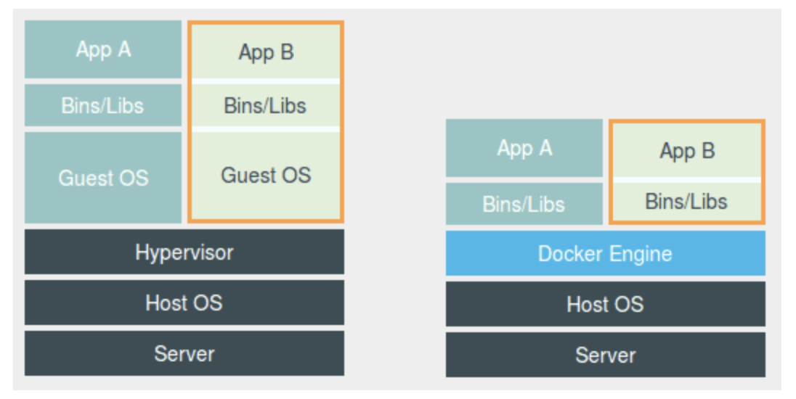
上图: Docker容易被误解为是轻量级的虚拟化技术

下图: 容器只是一种特殊的进程,与其他应用同级别
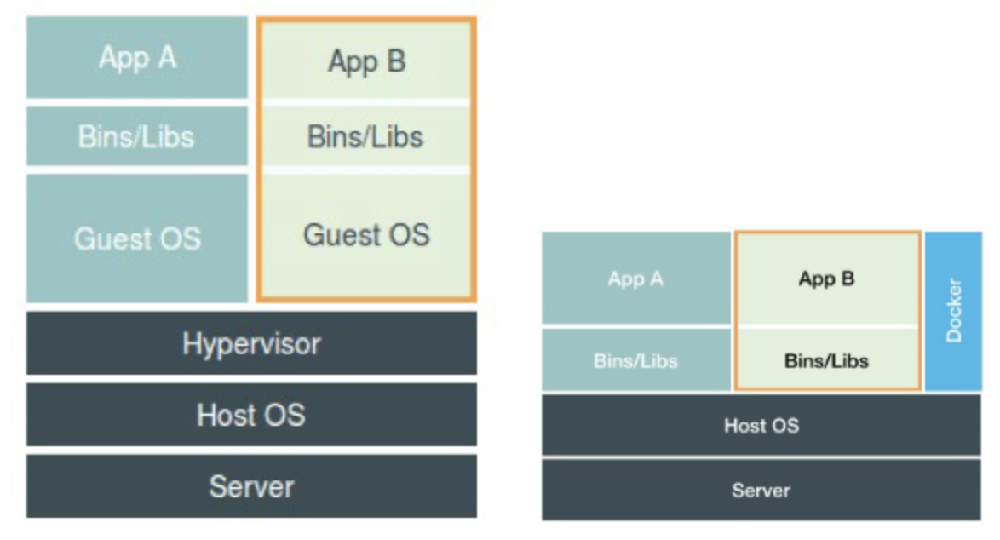

想比较虚拟化技术，Linux Namespace的隔离机制有很多不足之处，最主要的问题就是: 隔离得不彻底
- 容器之间使用的是同一个宿主机的操作系统内核
- Linux内核中有很多资源和对象不能被Namespace化，比如时间
  - 在容器中的程序使用settimeofday(2)系统调用修改了时间后，宿主机的时间会被修改

## [07 | 白话容器基础（三）：深入理解容器镜像](https://time.geekbang.org/column/article/17921)

- chroot: change root file system → 改变进程的根目录到指定位置
  - Namespace基于chroot的不断改良
- 挂载在容器根目录上，用来为容易进程提供隔离后执行环境的文件系统(rootfs) → 容器镜像(OS文件 + 目录 + 应用)
    - rootfs不包括OS内核
    - 提供一致性

对 Docker 项目来说，它最核心的原理实际上就是为待创建的用户进程
1. 启用 Linux Namespace 配置
2. 设置指定的 Cgroups 参数
3. 切换进程的根目录

★ Docker在镜像的设计中，引入了 **层（layer）** 的概念。用户制作镜像的每一步操作都会生成一个层(**增量 rootfs**)。

层（layer)的想法源于
Union File System(UnionFS)，将多个不同位置的目录联合挂载（union mount）到同一目录下

```
$ tree
.
├── A
│  ├── a
│  └── x
└── B
  ├── b
  └── x

$ mkdir C
$ mount -t aufs -o dirs=./A:./B none ./C

$ tree ./C
./C
├── a
├── b
└── x
```

```
$ docker image inspect ubuntu:latest
...
     "RootFS": {
      "Type": "layers",
      "Layers": [
        "sha256:f49017d4d5ce9c0f544c...",
        "sha256:8f2b771487e9d6354080...",
        "sha256:ccd4d61916aaa2159429...",
        "sha256:c01d74f99de40e097c73...",
        "sha256:268a067217b5fe78e000..."
      ]
    }

```
Ubuntu 镜像，实际上由五个层组成(增量 rootfs),每一层都是 Ubuntu 操作系统文件与目录的一部分

Docker 会把这些增量联合挂载在一个统一的挂载点(/var/lib/docker/aufs/mnt/)上
```
/var/lib/docker/aufs/mnt/6e3be5d2ecccae7cc0fcfa2a2f5c89dc21ee30e166be823ceaeba15dce645b3e

```
这个目录里面正是一个完整的 Ubuntu 操作系统
```
$ ls /var/lib/docker/aufs/mnt/6e3be5d2ecccae7cc0fcfa2a2f5c89dc21ee30e166be823ceaeba15dce645b3e
bin boot dev etc home lib lib64 media mnt opt proc root run sbin srv sys tmp usr var

```


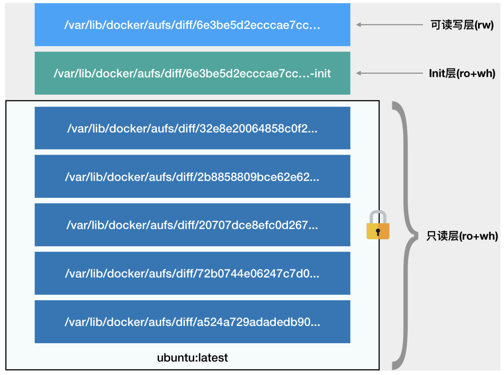
- 只读层
  - 对应Ubuntu的五个层组成
- Init层
  - Docker 项目单独生成的一个内部层，存放 /etc/hosts、/etc/resolv.conf等信息
- 可读写层
  - 用户删除只读层文件时，AuFS 会在可读写层创建一个whiteout文件把对象文件隐藏(非删除)
  - **用户执行 docker commit 只会提交可读写层**

## [08 | 白话容器基础（四）：重新认识Docker容器](https://time.geekbang.org/column/article/18119)

- Dockerfile 中的每个原语执行后，都会生成一个对应的镜像层。
  - FROM / RUN / CMD 等等

- 一个进程，可以选择加入到某个进程已有的 Namespace当中，从而达到“进入”这个进程所在容器的目的，这正是docker exec 的实现原理。
  - 一个进程的 Namespace 信息在宿主机上以文件的方式存在。  
每种 Linux Namespace，都在它对应的 /proc/[进程号]/ns 下有一个对应的虚拟文件，并且链接到一个真实的 Namespace 文件上。
  - 4ddf4638572d: 例子里的容器ID

```
$ docker inspect --format '{{ .State.Pid }}'  4ddf4638572d
25686


$ ls -l  /proc/25686/ns
total 0
lrwxrwxrwx 1 root root 0 Aug 13 14:05 cgroup -> cgroup:[4026531835]
lrwxrwxrwx 1 root root 0 Aug 13 14:05 ipc -> ipc:[4026532278]
lrwxrwxrwx 1 root root 0 Aug 13 14:05 mnt -> mnt:[4026532276]
lrwxrwxrwx 1 root root 0 Aug 13 14:05 net -> net:[4026532281]
lrwxrwxrwx 1 root root 0 Aug 13 14:05 pid -> pid:[4026532279]
lrwxrwxrwx 1 root root 0 Aug 13 14:05 pid_for_children -> pid:[4026532279]
lrwxrwxrwx 1 root root 0 Aug 13 14:05 user -> user:[4026531837]
lrwxrwxrwx 1 root root 0 Aug 13 14:05 uts -> uts:[4026532277]

```

以下命令: 启动一个容器，该容易与容器4ddf4638572d共用Network Namespace.

```
$ docker run -it --net container:4ddf4638572d busybox ifconfig
```

在容器里对镜像 rootfs 所做的任何修改，都会被操作系统先复制到这个可读写层，然后再修改。这就是所谓的：**Copy-on-Write**

- Volume 挂载机制
  - 当容器进程被创建之后，尽管开启了 Mount Namespace，但是在它执行 chroot（或者 pivot_root）之前，容器进程一直可以看到宿主机上的整个文件系统。  
  容器镜像的各个层，保存在 /var/lib/docker/aufs/diff 目录下，在容器进程启动后，它们会被联合挂载在 /var/lib/docker/aufs/mnt/ 目录中，这样容器所需的 rootfs 就准备好了
  - 只需要在 rootfs 准备好之后，在执行 chroot 之前,把 Volume 指定的宿主机目录, 挂载到指定的 **容器目录在宿主机上对应的目录**（即 /var/lib/docker/aufs/mnt/[可读写层 ID]/<目录名>）上, Volume的挂载工作就完成了

## [09 | 从容器到容器云：谈谈Kubernetes的本质](https://time.geekbang.org/column/article/23132)

Docker: Compose + Swarm
Google + RedHat : Kubernetes

**Borg → Kubernetes**
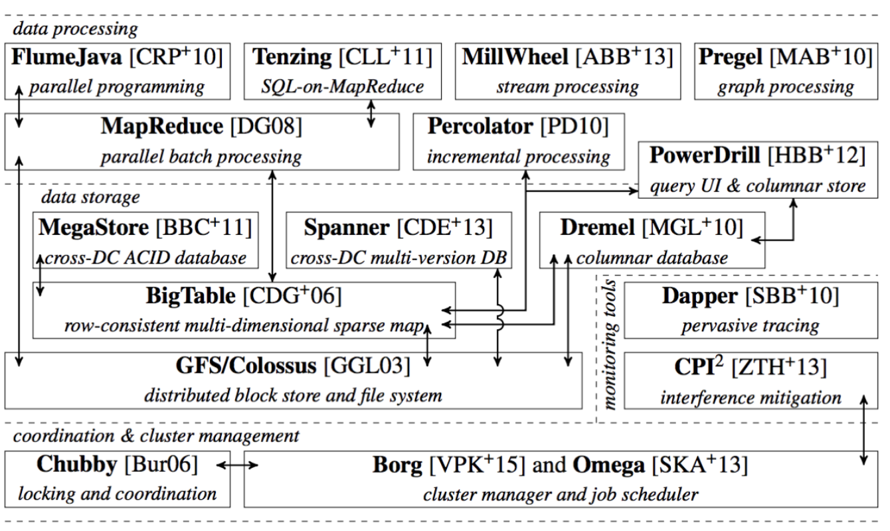


**k8s项目的架构**

Master + Node

- Master
  - kube-apiserver : 负责API服务
    - 整个集群持久化数据，由kube-apiserver处理后保存到Etcd
  - kube-scheduler : 负责调度
  - kube-controller-manager : 负责容器编排

- Node
  - kubelet : (核心组件)主要负责同容器运行时（比如 Docker 项目）打交道
    - 交互依赖于CRI（Container Runtime Interface)的远程调用接口
      - CRI定义了容器运行时的各项核心操作
    - 通过 gRPC 协议同一个叫作 Device  Plugin的插件进行交互
      - gRPC是管理 GPU 等宿主机物理设备的主要组件，进行机器学习训练、高性能作业支持等工作必须关注的功能
    - kubelet 的另一个重要功能，则是调用网络插件和存储插件为容器配置网络和持久化存储
      - CNI（Container Networking Interface) / CSI（Container Storage Interfacce)


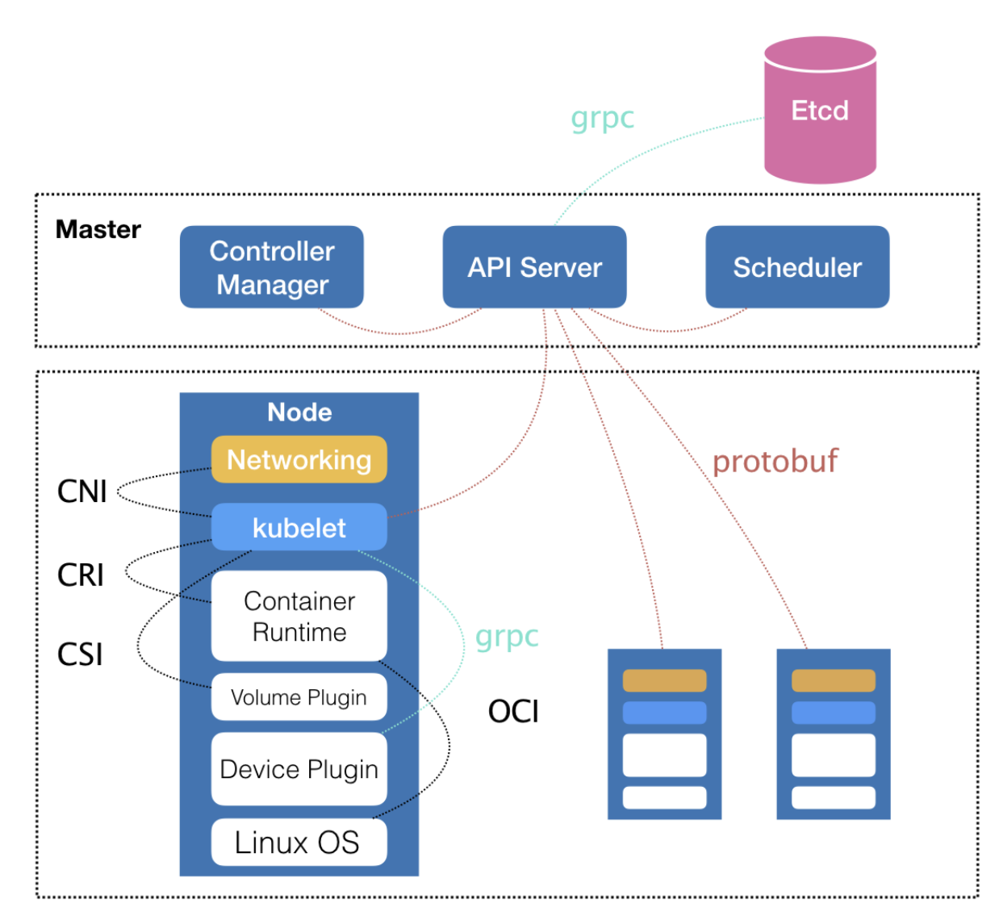

**Kubernetes 项目要着重解决的问题**
>运行在大规模集群中的各种任务之间，实际上存在着各种各样的关系。这些关系的处理，才是作业编排和管理系统最困难的地方。

Service 服务的主要作用，就是作为 Pod 的代理入口（Portal），从而代替 Pod 对外暴露一个固定的网络地址

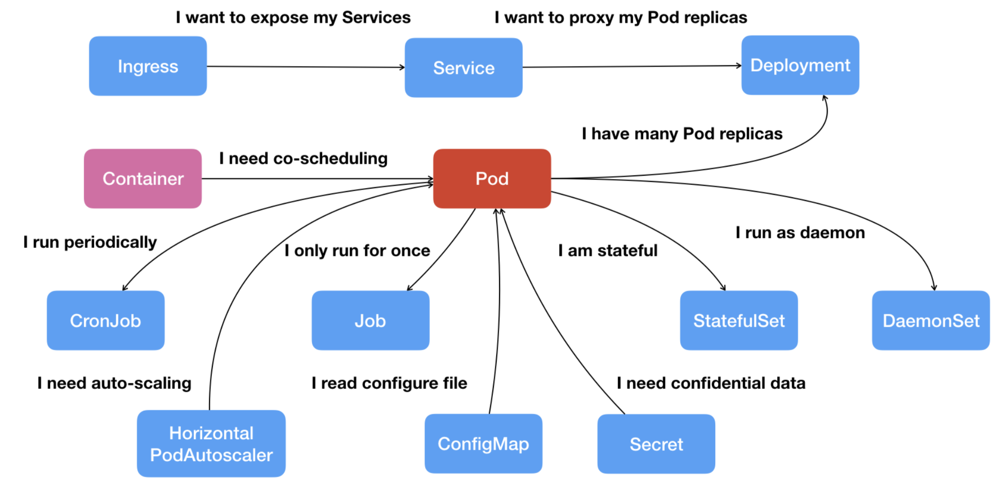

Credential 信息以 Secret 的方式存在 Etcd里，就会在你指定的 Pod（比如，Web 应用的 Pod）启动时，自动把 Secret 里的数据以 Volume 的方式挂载到容器里。

## [10 | Kubernetes一键部署利器：kubeadm](https://time.geekbang.org/column/article/39712)

**Static Pod** k8s中的特殊的容器启动方法
  - 把要部署的 Pod 的 YAML 文件放在一个指定的目录里。 当这台机器上的 kubelet 启动时自动检查该目录，加载所有的 Pod YAML 文件，然后在这台机器上启动它们

kubeadm **不能用于生产环境** (2018年9月)

## [11 | 从0到1：搭建一个完整的Kubernetes集群](https://time.geekbang.org/column/article/39724)

- 容器网络插件通过CNI接入k8s
  - 例如, Flannel、Calico、Canal、Romana 等

- 默认情况下 Master 节点是不允许运行用户 Pod
  - Taint/Toleration: Taint是键值对
  - Pod不会运行在有Taint的Node上，除非设置了相应的Toleration

Node上打Taint

```
$ kubectl taint nodes node1 foo=bar:NoSchedule
```

Pod的 .yaml的spec中加入tolerations
```
apiVersion: v1
kind: Pod
...
spec:
  tolerations:
  - key: "foo"
    operator: "Equal"
    value: "bar"
    effect: "NoSchedule"
```

## [12 | 牛刀小试：我的第一个容器化应用](https://time.geekbang.org/column/article/40008)

kubectl create,kubectl replace
→ 推荐使用kubectl apply (不必关心当前的操作是创建，还是更新)

- 一个YAML文件 → k8s API对象

- 1 Pod, 1 应用, N Container

- “控制器”模式（controller pattern）
  - 使用一种 API 对象（Deployment）管理另一种 API 对象（Pod）
  - 比如，Deployment 扮演的正是 Pod 的控制器的角色

- Lables
  - 用户需要的key-value 格式的标签
  - Deployment 通过这个 Labels 字段从 Kubernetes 中过滤出它所关心的被控制对象

- Annotations
  - k8s组件需要的key-value格式的内部信息

- emptyDir类型
  - 不显式声明宿主机目录的 Volume

## [13 | 为什么我们需要Pod？](https://time.geekbang.org/column/article/40092)

Namespace 做隔离，Cgroups 做限制，rootfs 做文件系统

容器的“单进程模型”，并不是指容器里只能运行“一个”进程，而是指**容器没有管理多个进程的能力**

- Pod只是一个逻辑概念, k8s真正处理的还是宿主机操作系统上 Linux 容器的 Namespace 和 Cgroups
  - Pod是一组共享了某些资源的容器
  - Pod 里的所有容器**共享同一个 Network Namespace**，并且可以声明共享同一个 Volume


- **infra容器**
  - infra容器是第一个被创建的容器，Pod里的用户的容器都由infra容器创建
  - infra容器创建出Network Namespace, 其他容器通过 Join Network Namespace 的方式，与 Infra 容器关联在一起
  - k8s.gcr.io/pause 是个非常特殊的镜像, 永远处于“暂停”状态的容器，解压后的大小也只有 100~200 KB 左右
  - 同一个 Pod 里面的所有用户容器来说， 它们的进出流量，也可以认为都是通过 Infra 容器完成的
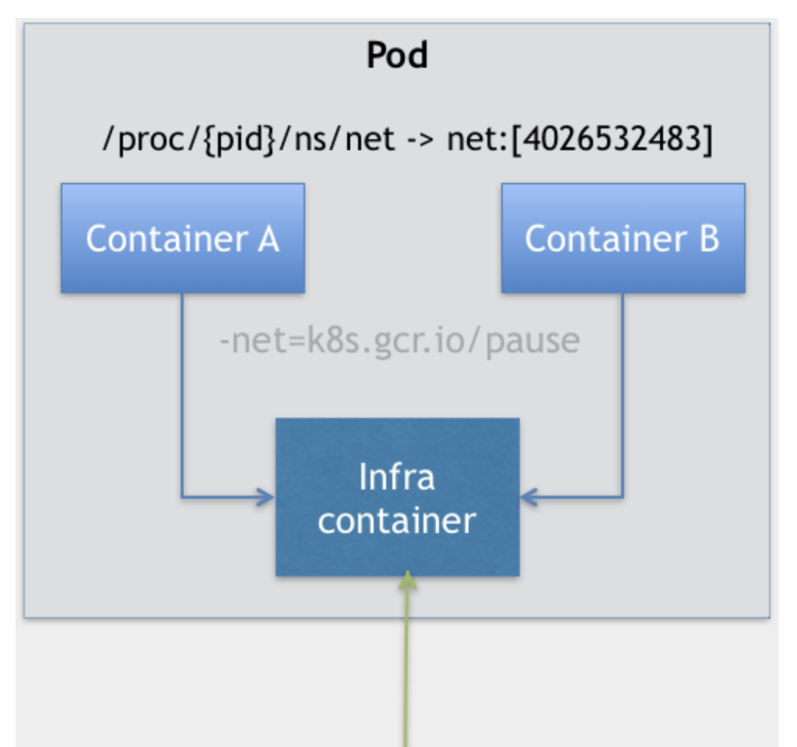


- **initContainers**
  - 创建有拓扑关系的容器时使用
  - 比如解决了 WAR 包与 Tomcat 容器之间耦合关系的问题 → sidecar

- **sidecar**
  - 在Pod里启动一个辅助容器，来完成一些独立于主进程(主容器)之外的工作
  - Pod里的所有容器共享同一个Network Namespace,很多与 Pod 网络相关的配置和管理，也都可以交给 sidecar 完成，而完全无须干涉用户容器。→ 最典型的列子就是 Istio(微服务治理项目)

```
apiVersion: v1
kind: Pod
metadata:
  name: javaweb-2
spec:
  initContainers:
  - image: geektime/sample:v2
    name: war
    command: ["cp", "/sample.war", "/app"]
    volumeMounts:
    - mountPath: /app
      name: app-volume
  containers:
  - image: geektime/tomcat:7.0
    name: tomcat
    command: ["sh","-c","/root/apache-tomcat-7.0.42-v2/bin/start.sh"]
    volumeMounts:
    - mountPath: /root/apache-tomcat-7.0.42-v2/webapps
      name: app-volume
    ports:
    - containerPort: 8080
      hostPort: 8001
  volumes:
  - name: app-volume
    emptyDir: {}
```
- **容器设计模式**
  - Google论文 → [Design patterns for container-based distributed systems](https://www.usenix.org/system/files/conference/hotcloud16/hotcloud16_burns.pdf)

## [14 | 深入解析Pod对象（一）：基本概念](https://time.geekbang.org/column/article/40366)

Pod 级别的属性: 调度、网络、存储，以及安全相关的

- Pod 中几个重要字段的含义和用法
  - NodeSelector：是一个供用户将Pod 与 Node 进行绑定的字段  
  一下示例，Pod 永远只能运行在携带了“disktype: ssd” 标签（Label）的节点上；否则，它将调度失败。

  ```
  apiVersion: v1
  kind: Pod
  ...
  spec:
   nodeSelector:
     disktype: ssd
  ```
  - NodeName : 一旦 Pod 的这个字段被赋值，Kubernetes 项目就会被认为这个 Pod 已经经过了调度，调度的结果就是赋值的节点名字
  - HostAliases：定义了 Pod 的 hosts 文件（比如 /etc/hosts ）里的内容

  ```
  apiVersion: v1
kind: Pod
...
spec:
  hostAliases:
  - ip: "10.1.2.3"
    hostnames:
    - "foo.remote"
    - "bar.remote"
...

  ```
  这个 Pod 启动后，/etc/hosts 文件的内容将如下
  ```
  cat /etc/hosts
  # Kubernetes-managed hosts file.
  127.0.0.1 localhost
  ...
  10.244.135.10 hostaliases-pod
  10.1.2.3 foo.remote
  10.1.2.3 bar.remote

  ```

- ImagePullPolicy
  - Always: 每次创建 Pod 都重新拉取一次镜像
  - IfNotPresent: 只在宿主机上不存在这个镜像时才拉取
  - Never: 永远不会主动拉取这个镜像

- Lifecycle: Container Lifecycle Hooks
  - postStart: 在容器启动后，立刻执行一个指定的操作
    - 虽然是在 Docker 容器 ENTRYPOINT 执行之后，但它并不严格保证顺序。在 postStart 启动时，ENTRYPOINT 有可能还没结束
  - preStop: 容器被杀死之前（比如，收到了 SIGKILL 信号）, 立刻执行一个指定的操作
    - preStop 操作的执行，是同步的 它会阻塞当前的容器杀死流程，直到这个 Hook 定义操作完成之后，才允许容器被杀死

- pod.status.phase  
Pod 生命周期的变化，主要体现在 Pod API 对象的Status部分
  - Pending: Pod 的 YAML 文件已经提交给了 Kubernetes，API 对象已经被创建并保存在 Etcd 当中。但是，这个 Pod 里有些容器因为某种原因而不能被顺利创建。
  - Running: Pod 已经调度成功，跟一个具体的节点绑定。 它包含的容器都已经创建成功，并且至少有一个正在运行中。
  - Succeeded: Pod 里的所有容器都正常运行完毕，并且已退出
  - Failed: Pod 里至少有一个容器以不正常的状态（非 0 的返回码）退出
  - Unknown: Pod 的状态不能持续地被 kubelet 汇报给 kub-apiserver，这很有可能是主从节点（Maste和 Kubelet）间的通信出现了问题

## [15 | 深入解析Pod对象（二）：使用进阶](https://time.geekbang.org/column/article/40466)

- Kubernetes 支持的Projected Volume 一共有四种  
Projected Volume的目的是**为容器提供预先定义好的数据**
  - Secret
    - 加密数据，存放到Etcd中
  - ConfigMap
    - 用于保存无需加密的，应用所需的配置信息
  - Downward API
    - 让 Pod 里的容器能够直接获取到这个 Pod API 对象本身的信息
  - ServiceAccountToken
    - 是一种特殊的 Secret
    - Kubernetes 集群上的应用，都必须使用这个 ServiceAccountToken 里保存的授权信息，，也就是 Token，才可以合法地访问 API Server
    - k8s提供默认“服务账户”（default Service Account），Pod可以直接使用这个默认的 Service Account，而无需显示地声明挂载它。
      - Pod 创建完成，容器里的应用就可以直接从这个默认 ServiceAccountToken 的挂载目录访问到授权信息和文件。
      - 容器内的路径固定，/var/run/secrets/kubernetes.io/serviceaccount
      ```
      $ ls /var/run/secrets/kubernetes.io/serviceaccount
ca.crt namespace  token
      ```

容器健康检查和恢复机制

- pod.spec.restartPolicy
  - 默认值是 Always: 任何时候这个容器发生了异常，它一定会被重新创建。  
  **Pod 的恢复过程，永远都是发生在当前节点上，而不会跑到别的节点.就算宕机的时候也不会主动迁移去其他节点**
  - OnFailure: 只在容器 异常时才自动重启容器
  - Never: 从来不重启容器

- restartPolicy的两个基本的设计原理
  - 只要 Pod 的 restartPolicy 指定的策略允许重启异常的容器（比如：Always），那么这个 Pod 就会保持 Running 状态，并进行容器重启
  - 对于包含多个容器的 Pod，只有它里面所有的容器都进入异常状态后，Pod 才会进入 Failed状态


**PodPreset(Pod的预设置)**

例子，运维人员就可以定义一个 PodPreset 对象。在这个对象中，凡是他想在开发人员编写的 Pod 里追加的字段，都可以预先定义好。比如这个 preset.yaml
```
apiVersion: settings.k8s.io/v1alpha1
kind: PodPreset
metadata:
  name: allow-database
spec:
  selector:
    matchLabels:
      role: frontend
  env:
    - name: DB_PORT
      value: "6379"
  volumeMounts:
    - mountPath: /cache
      name: cache-volume
  volumes:
    - name: cache-volume
      emptyDir: {}
```

开发人员编写了如下一个 pod.yaml 文件
```
apiVersion: v1
kind: Pod
metadata:
  name: website
  labels:
    app: website
    role: frontend
spec:
  containers:
    - name: website
      image: nginx
      ports:
        - containerPort: 80
```
假定运维人员先创建了这个 PodPreset，然后开发人员才创建 Pod
```
$ kubectl create -f preset.yaml
$ kubectl create -f pod.yaml
```

```
$ kubectl get pod website -o yaml
apiVersion: v1
kind: Pod
metadata:
  name: website
  labels:
    app: website
    role: frontend
  annotations:
    podpreset.admission.kubernetes.io/podpreset-allow-database: "resource version"
spec:
  containers:
    - name: website
      image: nginx
      volumeMounts:
        - mountPath: /cache
          name: cache-volume
      ports:
        - containerPort: 80
      env:
        - name: DB_PORT
          value: "6379"
  volumes:
    - name: cache-volume
      emptyDir: {}
```

这个 Pod 里多了新添加的 labels、env、volumes 和 volumeMount 的定义，它们的配置跟 PodPreset 的内容一样


## [16 | 编排其实很简单：谈谈“控制器”模型](https://time.geekbang.org/column/article/40583)

kube-controller-manager: 一系列控制器的集合
```
$ cd kubernetes/pkg/controller/
$ ls -d */              
deployment/             job/                    podautoscaler/          
cloud/                  disruption/             namespace/              
replicaset/             serviceaccount/         volume/
cronjob/                garbagecollector/       nodelifecycle/          replication/            statefulset/            daemon/
...
```


**控制循环（control loop）**

以下用一段伪代码描述控制循环
```
for {
  实际状态 := 获取集群中对象 X 的实际状态（Actual State）
  期望状态 := 获取集群中对象 X 的期望状态（Desired State）
  if 实际状态 == 期望状态{
    什么都不做
  } else {
    执行编排动作，将实际状态调整为期望状态
  }
}
```
**实际状态** 往往来自于 Kubernetes 集群本身;**期望状态** 一般来自于用户提交的 YAML 文件

- 以 Deployment 为例，我和你简单描述一下它对控制器模型的实现
  1. Deployment 控制器从 Etcd 中获取到所有携带了“app: nginx”标签的 Pod，然后统计它们的数量，这就是实际状态
  1. Deployment 对象的 Replicas 字段的值就是期望状态
  1. Deployment 控制器将两个状态做比较，然后根据比较结果，确定是创建 Pod，还是删除已有的 Pod
- 一个 Kubernetes 对象的主要编排逻辑， 实际上是在第三步的“对比”阶段完成的。 这个操作，通常被叫作**调谐（Reconcile）**。这个调谐的过程，则被称作**“Reconcile Loop”（调谐循环）或者“Sync Loop”（同步循环）**

类似 Deployment 这样的一个控制器，实际上都是**由上半部分的控制器定义（包括期望状态），加上下半部分的被控制对象的模板组成**的
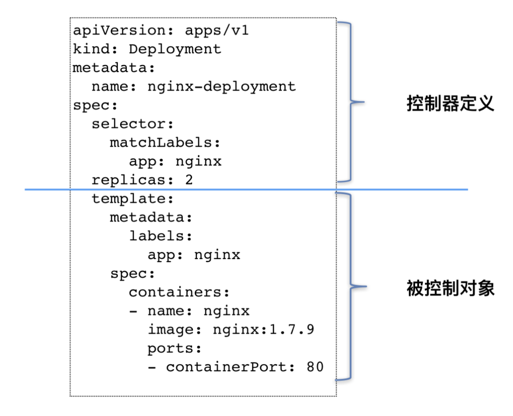

## [17 | 经典PaaS的记忆：作业副本与水平扩展](https://time.geekbang.org/column/article/40906)

更新Deployment 的 Pod 模板需要遵循一种叫做 **滚动更新(rolling update)** 的方式，这依赖于**ReplicaSet **

一个 ReplicaSet 对象，其实就是由副本数目的定义和一个 Pod 模板组成的。Deployment控制器实际操纵的是ReplicaSetd对象

```
apiVersion: apps/v1
kind: ReplicaSet
metadata:
  name: nginx-set
  labels:
    app: nginx
spec:
  replicas: 3
  selector:
    matchLabels:
      app: nginx
  template:
    metadata:
      labels:
        app: nginx
    spec:
      containers:
      - name: nginx
        image: nginx:1.7.9
```
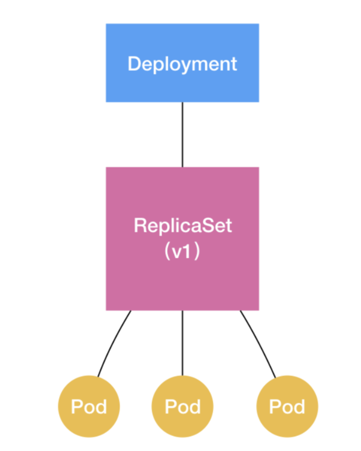

**RollingUpdateStrategy**
- maxSurge: 除了 DESIRED 数量之外，在一次“滚动”中，Deployment 控制器还可以创建多少个新 Pod
- maxUnavailable: 在一次“滚动”中，Deployment 控制器可以删除多少个旧 Pod

```
apiVersion: apps/v1
kind: Deployment
metadata:
  name: nginx-deployment
  labels:
    app: nginx
spec:
...
  strategy:
    type: RollingUpdate
    rollingUpdate:
      maxSurge: 1
      maxUnavailable: 1
```

镜像更新
```
$ kubectl set image deployment/nginx-deployment nginx=nginx:1.91
deployment.extensions/nginx-deployment image updated
```

镜像更新失败是执行的命令
 - 可使用 kubectl rollout history 命令，查看每次 Deployment 变更对应的版本
```
$ kubectl rollout undo deployment/nginx-deployment
deployment.extensions/nginx-deployment
```
```
$ kubectl rollout history deployment/nginx-deployment
deployments "nginx-deployment"
REVISION    CHANGE-CAUSE
1           kubectl create -f nginx-deployment.yaml --record
2           kubectl edit deployment/nginx-deployment
3           kubectl set image deployment/nginx-deployment nginx=nginx:1.91
```
```
$ kubectl rollout undo deployment/nginx-deployment --to-revision=2
deployment.extensions/nginx-deployment
```

**kubectl rollout pause**  
让 Deployment 进入了一个“暂停”状态

→ 对 Deployment 的所有修改，都不会触发新的“滚动更新”，也不会创建新的 ReplicaSet
```
$ kubectl rollout pause deployment/nginx-deployment
deployment.extensions/nginx-deployment paused
```

→ 手动触发一次更新
```
$ kubectl rollout resume deploy/nginx-deployment
deployment.extensions/nginx-deployment resumed
```

**Deployment 实际上是一个两层控制器**
1. 通过ReplicaSet 的个数来描述应用的版本
2. 通过ReplicaSet 的属性（比如 replicas 的值），来保证 Pod 的副本数量

**会话黏连（session sticky）** 光靠Deployment很难解决

## [18 | 深入理解StatefulSet（一）：拓扑状态](https://time.geekbang.org/column/article/41017)

StatefulSet 的核心功能，就是通过某种方式记录这些状态，然后在 Pod 被重新创建时，能够为新 Pod 恢复这些状态

- 使用Service访问
  - VIP(Virtual IP)方式
  - DNS方式
    - Normal Service  
    访问该域名，解析到的是Service后面的VIP
    - Headless Service  
    访问该域名，解析到的是某个Pod的IP

- Headless Service 的作用
```
apiVersion: v1
kind: Service
metadata:
  name: nginx
  labels:
    app: nginx
spec:
  ports:
  - port: 80
    name: web
  clusterIP: None
  selector:
    app: nginx
```
clusterIP字段的值是: None, 这个Service没有一个VIP作为“头”，这也就是Headless的含义。这个Service创建后没有VIP，以DNS的方式暴露出它代理的Pod。 Pod的IP地址会绑定如下DNS记录
```
<pod-name>.<svc-name>.<namespace>.svc.cluster.local
```


```
apiVersion: apps/v1
kind: StatefulSet
metadata:
  name: web
spec:
  serviceName: "nginx"
  replicas: 2
  selector:
    matchLabels:
      app: nginx
  template:
    metadata:
      labels:
        app: nginx
    spec:
      containers:
      - name: nginx
        image: nginx:1.9.1
        ports:
        - containerPort: 80
          name: web
```

**serviceName: "nginx"** 该字段的作用，告诉StatefulSet 控制器， 在执行控制循环（Control Loop）的时候，请使用nginx 这个 Headless Service 来保证Pod 的“可解析身份”（Resolvable Identity）
```
$ kubectl get service nginx
NAME      TYPE         CLUSTER-IP   EXTERNAL-IP   PORT(S)   AGE
nginx     ClusterIP    None         <none>        80/TCP    10s

$ kubectl get statefulset web
NAME      DESIRED   CURRENT   AGE
web       2         1         19s
```

```
$ kubectl get pods -w -l app=nginx
NAME      READY     STATUS    RESTARTS   AGE
web-0     0/1       Pending   0          0s
web-0     0/1       Pending   0         0s
web-0     0/1       ContainerCreating   0         0s
web-0     1/1       Running   0         19s
web-1     0/1       Pending   0         0s
web-1     0/1       Pending   0         0s
web-1     0/1       ContainerCreating   0         0s
web-1     1/1       Running   0         20s
```
StatefulSet 给它所管理的所有 Pod 的名字，进行了编号，编号规则是：-  
从 0 开始累加，与 StatefulSet 的每个 Pod 实例一一对应，绝不重复  
Pod 的创建，也是严格按照编号顺序进行的。前一个Pod进入到Running且为Ready之前，下一个Pod一直处于Pending

```
$ kubectl run -i --tty --image busybox dns-test --restart=Never --rm /bin/sh
$ nslookup web-0.nginx
Server:    10.0.0.10
Address 1: 10.0.0.10 kube-dns.kube-system.svc.cluster.local

Name:      web-0.nginx
Address 1: 10.244.1.7

$ nslookup web-1.nginx
Server:    10.0.0.10
Address 1: 10.0.0.10 kube-dns.kube-system.svc.cluster.local

Name:      web-1.nginx
Address 1: 10.244.2.7
```
```
$ kubectl delete pod -l app=nginx
pod "web-0" deleted
pod "web-1" deleted
```
```
$ kubectl get pod -w -l app=nginx
NAME      READY     STATUS              RESTARTS   AGE
web-0     0/1       ContainerCreating   0          0s
NAME      READY     STATUS    RESTARTS   AGE
web-0     1/1       Running   0          2s
web-1     0/1       Pending   0         0s
web-1     0/1       ContainerCreating   0         0s
web-1     1/1       Running   0         32s
```
这两个 Pod 删除之后，Kubernetes 会按照原先编号的顺序，创建出了两个新的 Pod。并且，Kubernetes 依然 **为它们分配了与原来相同的“网络身份”**：web-0.nginx 和 web-1.nginx  
通过这种严格的对应规则，**StatefulSet 就保证了 Pod 网络标识的稳定性**

再次用nslook查看
```
$ kubectl run -i --tty --image busybox dns-test --restart=Never --rm /bin/sh
$ nslookup web-0.nginx
Server:    10.0.0.10
Address 1: 10.0.0.10 kube-dns.kube-system.svc.cluster.local

Name:      web-0.nginx
Address 1: 10.244.1.8

$ nslookup web-1.nginx
Server:    10.0.0.10
Address 1: 10.0.0.10 kube-dns.kube-system.svc.cluster.local

Name:      web-1.nginx
Address 1: 10.244.2.8
```

## [19 | 深入理解StatefulSet（二）：存储状态](https://time.geekbang.org/column/article/41154)

第一步：定义一个 PVC，声明想要的 Volume 的属性：
```
kind: PersistentVolumeClaim
apiVersion: v1
metadata:
  name: pv-claim
spec:
  accessModes:
  - ReadWriteOnce
  resources:
    requests:
      storage: 1Gi
```
第二步：在应用的 Pod 中，声明使用这个 PVC：
```
apiVersion: v1
kind: Pod
metadata:
  name: pv-pod
spec:
  containers:
    - name: pv-container
      image: nginx
      ports:
        - containerPort: 80
          name: "http-server"
      volumeMounts:
        - mountPath: "/usr/share/nginx/html"
          name: pv-storage
  volumes:
    - name: pv-storage
      persistentVolumeClaim:
```
在 Pod 的 Volumes 定义中，只需要声明它的类型是 persistentVolumeClaim，指定 PVC 的名字，而完全不必关心 Volume 本身的定义

- PV（Persistent Volume）
  - 执行以下YAML后，k8s会为pvc绑定pv
```
kind: PersistentVolume
apiVersion: v1
metadata:
  name: pv-volume
  labels:
    type: local
spec:
  capacity:
    storage: 10Gi
  rbd:
    monitors:
    - '10.16.154.78:6789'
    - '10.16.154.82:6789'
    - '10.16.154.83:6789'
    pool: kube
    image: foo
    fsType: ext4
    readOnly: true
    user: admin
    keyring: /etc/ceph/keyring
    imageformat: "2"
    imagefeatures: "layering"
```

**PVC与PV，就像“接口” 和“实现”**   
开发者只要知道并会使用“接口”，即：PVC；而运维人员则负责“接口”绑定具体的实现，即：PV。  
避免了因为向开发者暴露过多的存储系统细节而带来的隐患。

**PVC、PV 的设计，也使得 StatefulSet 对存储状态的管理成为了可能**

Kubernetes 的 StatefulSet 实现对应用存储状态的管理的方式
- 首先，StatefulSet 的控制器直接管理的是 Pod
  - Pod的名字是固定不变的
- 其次，Kubernetes 通过 Headless Service，为这些有编号的 Pod，在 DNS 服务器中生成带有同样编号的 DNS 记录
  - DNS记录也固定不变
- 最后，StatefulSet 还为每一个 Pod 分配并创建一个同样编号的 PVC

**Pod被删除后，它对应的PVC，PV并不会被删除。StatefullSet控制器重新创建出Pod后，因Pod名字，DNS记录不变，重新对应它现有的PVC和PV**

## [20 | 深入理解StatefulSet（三）：有状态应用实践](https://time.geekbang.org/column/article/41217)

XtraBackup 是业界主要使用的开源 MySQL 备份和恢复工具

## [21 | 容器化守护进程的意义：DaemonSet](https://time.geekbang.org/column/article/41366)

- DaemonSet 的主要作用  
在 Kubernetes 集群里，运行一个 Daemon Pod
  - 这个 Pod 运行在 Kubernetes 集群里的每一个节点（Node）上
  - 每个节点上只有一个这样的 Pod 实例
  - 随着节点的增减而增减

Docker 容器里应用的日志，默认会保存在宿主机的 **/var/lib/docker/containers/{{. 容器 ID}}/{{. 容器 ID}}-json.log** 里

在 DaemonSet 上，我们一般都应该加上resources 字段，来限制它的 CPU 和内存使用，防止它占用过多的宿主机资源

**nodeAffinity**  
在指定的 Node 上创建新 Pod
- 例子
  - requiredDuringSchedulingIgnoredDuringExecution: 这个 nodeAffinity 必须在每次调度的时候予以考虑
  - 这个 Pod，将来只允许运行在“metadata.name”是“node-geektime”的节点上
```
补上
```

**DaemonSet Controller 会在创建 Pod的时候，自动在这个 Pod 的 API 对象里，加上这样一个 nodeAffinity 定义**

DaemonSet会给Pod加上一个与调度相关的字段: tolerations, 使得Pod”容忍“(tolerations)某些Node的”污点“(Taint)

一般情况下，被标记了 unschedulable“污点”的 Node，是不会有任何Pod被调度上去的（effect: NoSchedule)

## [22 | 撬动离线业务：Job与CronJob](https://time.geekbang.org/column/article/41607)

Job API例子

```
apiVersion: batch/v1
kind: Job
metadata:
  name: pi
spec:
  parallelism: 2
  completions: 4
  template:
    spec:
      containers:
      - name: pi
        image: resouer/ubuntu-bc
        command: ["sh", "-c", "echo 'scale=10000; 4*a(1)' | bc -l "]
      restartPolicy: Never
  backoffLimit: 4
```
spec.backoffLimitJob: 失败时重试的次数
spec.activeDeadlineSeconds: 设置最长运行时间
spec.parallelism: 最大的并行数
spec.completions: 最小的完成数

Job对象创建后，它的Pod模板被自动加上controller-uid=< 一个随机字符串 >的Lable。
Job对象本身会加上Lable相对应的Selector以保证它与Pod的对应关系。

Job里的restartPolicy只能被设置为：Never / OnFailure

- CronJob API例子  
CronJob是Job对象的控制器  
  - spec.concurrencyPolicy
    - Allow: 默认情况，这意味着这些 Job 可以同时存在
    - Forbid: 该创建周期会被跳过，不创建新的Pod
    - Replace: 新产生的 Job 会替换旧的、没有执行完的 Job
```
apiVersion: batch/v1beta1
kind: CronJob
metadata:
  name: hello
spec:
  schedule: "*/1 * * * *"
  jobTemplate:
    spec:
      template:
        spec:
          containers:
          - name: hello
            image: busybox
            args:
            - /bin/sh
            - -c
            - date; echo Hello from the Kubernetes cluster
          restartPolicy: OnFailure
```

## [23 | 声明式API与Kubernetes编程范式](https://time.geekbang.org/column/article/41769)

- Istio 项目
  - 2017 年 5 月，Google、IBM 和 Lyft 公司，共同宣布了 Istio 开源项目的诞生
  - Istio 最根本的组件，是运行在每一个应用 Pod 里的**Envoy 容器(高性能 C++ 网络代理)**  
  Istio 项目，则把Envoy 容器以 sidecar 容器的方式，运行在了每一个被治理的应用 Pod 中
  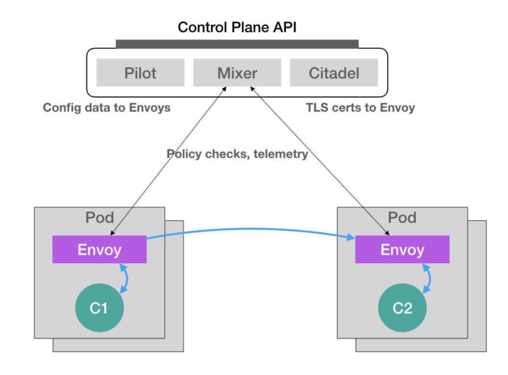

Istio 会将这个 Envoy 容器本身的定义，以 ConfigMap 的方式保存在 Kubernetes当中
```
apiVersion: v1
kind: ConfigMap
metadata:
  name: envoy-initializer
data:
  config: |
    containers:
      - name: envoy
        image: lyft/envoy:845747db88f102c0fd262ab234308e9e22f693a1
        command: ["/usr/local/bin/envoy"]
        args:
          - "--concurrency 4"
          - "--config-path /etc/envoy/envoy.json"
          - "--mode serve"
        ports:
          - containerPort: 80
            protocol: TCP
        resources:
          limits:
            cpu: "1000m"
            memory: "512Mi"
          requests:
            cpu: "100m"
            memory: "64Mi"
        volumeMounts:
          - name: envoy-conf
            mountPath: /etc/envoy
    volumes:
      - name: envoy-conf
        configMap:
          name: envoy
```

## [24 | 深入解析声明式API（一）：API对象的奥秘](https://time.geekbang.org/column/article/41876)

## [26 | 基于角色的权限控制：RBAC](https://time.geekbang.org/column/article/42154)

k8s的API对象保存在Etcd里，通过访问kube-apiserver(的授权)实现对API的调用  
负责完成授权（Authorization）工作的机制，就是RBAC（Role-Based Access Control）

- RBAC的三个概念
  - Role: 一组规则，定义了一组对 Kubernetes API 对象的操作权限
  - Subject: 被作用者
  - RoleBinding: 定义了“被作用者”和“角色”的绑定关系


## [28 | PV、PVC、StorageClass，这些到底在说啥？](https://time.geekbang.org/column/article/42698)

- PVC和PV进行绑定需要满足一下两点
  1. PV和PVC的spec字段
  1. PV和PVC的storageClassName字段必须一样  

  使用例子
  ```
  apiVersion: v1
kind: Pod
metadata:
  labels:
    role: web-frontend
spec:
  containers:
  - name: web
    image: nginx
    ports:
      - name: web
        containerPort: 80
    volumeMounts:
        - name: nfs
          mountPath: "/usr/share/nginx/html"
  volumes:
  - name: nfs
    persistentVolumeClaim:
      claimName: nfs
  ```  

PVC 和 PV 的设计，其实跟“面向对象”的思想完全一致  
PVC可以理解为持久化储存的“接口”，提供某种持久化储存的描述，但不提供具体实现  
PV负责持久化储存的实现

PersistentVolumeController: 负责PV和PVC的对应

- Dynamic Provisioning: 自动创建 PV 的机制
  - 其核心在于StorageClass的API
    - StorageClass的作用是创建PV的模板
- Static Provisioning: PV与PVC的手动对应
  - 在做绑定决策的时候 会考虑 PV 和 PVC 的 StorageClass 定义

- StorageClass的定义
  - PV 的属性。比如，存储类型、Volume 的大小等等
  - 创建这种 PV 需要用到的存储插件。比如，Ceph 等等

```
apiVersion: v1
kind: PersistentVolumeClaim
metadata:
  name: claim1
spec:
  accessModes:
    - ReadWriteOnce
  storageClassName: block-service
  resources:
    requests:
      storage: 30Gi
```

Kubernetes 只会将 StorageClass 相同的 PVC 和 PV 绑定起来

- 以下图片说明了PV，PVC，StorageClass三者的关系  
指定 PV 的 Provisioner（存储插件） 必须支持 Dynamic Provisioning
  - PVC: Pod 想要使用的持久化存储的属性，比如存储的大小、读写权限等
  - PV: 一个具体的 Volume 的属性，比如 Volume 的类型、挂载目录、远程存储服务器地址等
  - StorageClass: PV 的模板。并且，只有同属于一个 StorageClass的 PV 和 PVC，才可以绑定在一起
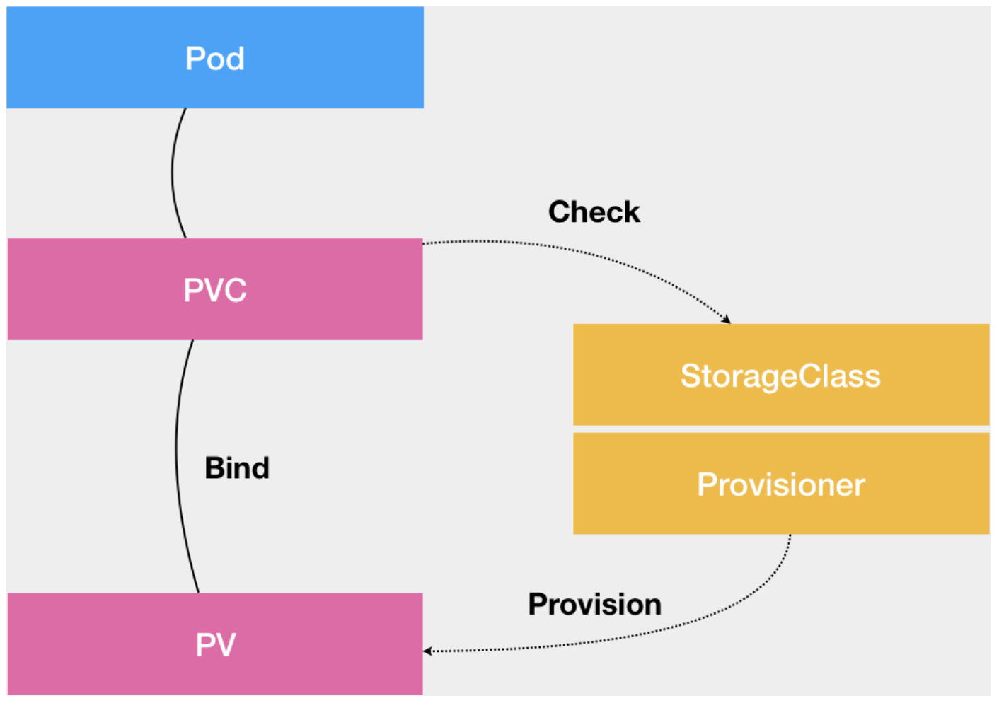


.
